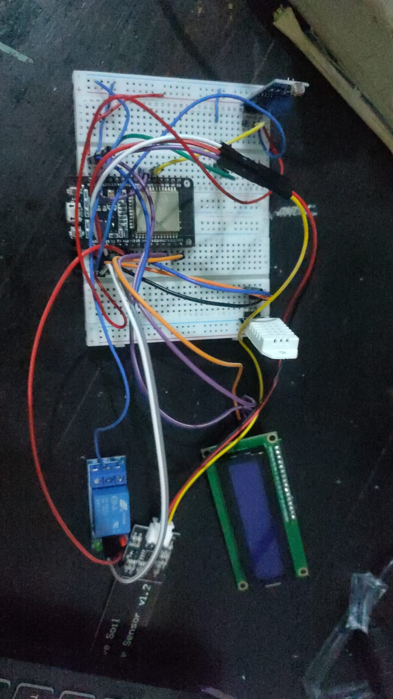
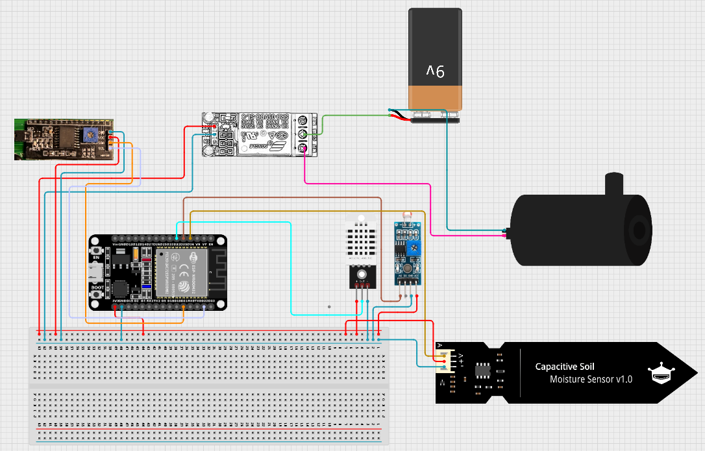
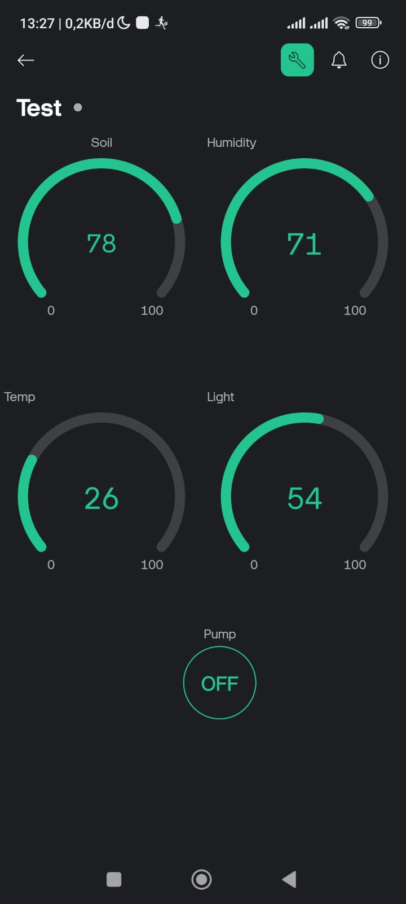
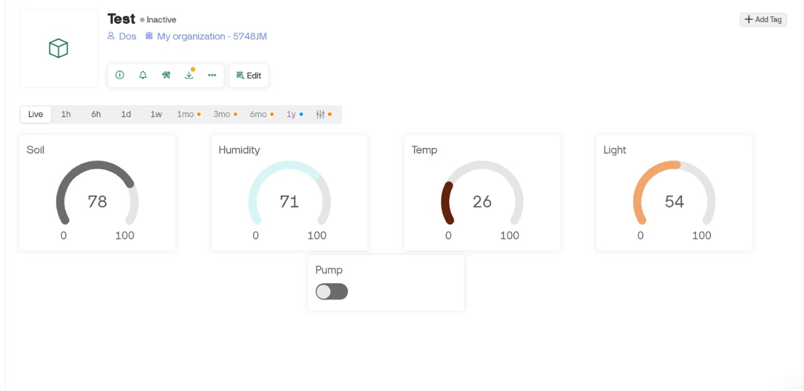

# 🌱 Smart Plant Care System (ESP32 + Blynk)

Sistem monitoring dan penyiraman otomatis tanaman berbasis IoT menggunakan **ESP32**, **Blynk**, dan berbagai sensor lingkungan. Proyek ini bertujuan untuk memantau suhu, kelembapan, cahaya, dan kelembaban tanah serta mengontrol pompa air secara otomatis maupun manual melalui aplikasi **Blynk**.

---

## 📷 Foto Produk


---

## 🔧 Fitur Utama

- 💧 Monitoring kelembaban tanah (Soil Moisture Sensor)
- 🌡️ Monitoring suhu & kelembaban udara (DHT22)
- ☀️ Monitoring intensitas cahaya (LDR)
- 📲 Tampilan data real-time di Blynk Cloud
- 🚿 Kontrol pompa air otomatis/manual
- 🖥️ Tampilan LCD I2C untuk feedback lokal

---

## ⚙️ Hardware yang Digunakan

| Komponen            | Jumlah | Keterangan                        |
|---------------------|--------|-----------------------------------|
| ESP32 Dev Board     | 1      | Mikrokontroler utama              |
| Sensor DHT22        | 1      | Pengukur suhu & kelembapan udara |
| Sensor Kelembaban Tanah | 1   | Analog output                    |
| Sensor LDR          | 1      | Sensor cahaya analog             |
| Relay 1 Channel     | 1      | Kontrol pompa air                |
| Pompa DC 5V/12V     | 1      | Aktuator penyiraman              |
| LCD I2C 16x2        | 1      | Tampilan lokal                   |
| Push Button         | 1      | Tombol fisik untuk trigger relay |

---

## 🔌 Wiring Diagram



---

## 🧠 Cara Kerja

1. Sensor membaca data suhu, kelembapan, cahaya, dan kelembaban tanah secara berkala.
2. Data dikirimkan ke **Blynk Cloud** dan ditampilkan di aplikasi.
3. Jika kelembaban tanah rendah, user bisa mengaktifkan pompa air secara **manual** melalui aplikasi atau **otomatis** (dengan pengembangan lebih lanjut).
4. Status pompa dan nilai sensor juga ditampilkan di **LCD** lokal.

---

## 📲 Tampilan Aplikasi Blynk



- V0: Temperatur (°C)
- V1: Kelembapan Udara (%)
- V2: Intensitas Cahaya (%)
- V3: Kelembaban Tanah (%)
- V12: Tombol pompa air (ON/OFF)

---

## 💻 Konfigurasi dan Instalasi



1. Unggah kode ke ESP32 melalui Arduino IDE.
2. Install library berikut:
   - `BlynkSimpleEsp32`
   - `DHT sensor library`
   - `LiquidCrystal_I2C`
3. Ganti:
   ```cpp
   char auth[] = "TOKEN_KAMU";
   char ssid[] = "NAMA_WIFI";
   char pass[] = "PASSWORD_WIFI";
